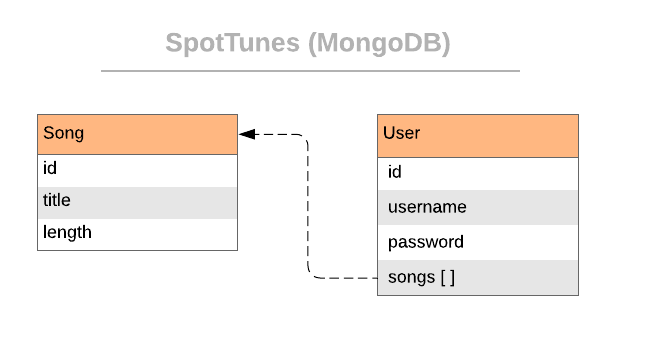

# SpotTunes
A Spotify Clone using MongoDB 

# Design

There are two models, User and Song. The User object holds the fields id, username, password, and songs. 
The Song object has an id, title and length. User references Song. There is a REST Controller API that allows users to do CRUD on both User and Song collection.

# Team Members
Iqbal Anwar (@<a href = "https://github.com/iqbalanwar">iqbalanwar</a>) 
Christine Le (@<a href="https://github.com/le-christine">le-christine</a>) 

# Completions

The endpoints are successfully able to:
- Signup user
- Login user
- Update user password
- Delete user
- Add song
- Delete song
- Update song title

# Challenges

Some challenges were to create queries that select specific objects. In the beginning it was difficult to identify User Object by username but once we figured it out this allowed us to update the additional fields. 

# Reflection 

SQL is preferable because it gives us more flexibility to join tables instead of parsing through referenced objects.
Our most enjoyable experience was when we were able to return an object based on our queries because this was something we struggled with.
